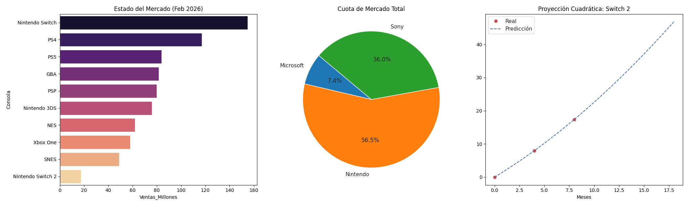

# Análisis de Mercado: Consolas más vendidas (Feb 2026)

Este proyecto aplica un ciclo completo de análisis de datos sobre el ranking actualizado de hardware de videojuegos, basado en el reporte de Vandal de febrero de 2026.

## 1. Definición de Objetivos
- Identificar al fabricante líder en ventas históricas.
- Comparar el rendimiento de consolas portátiles vs. sobremesa.
- Monitorear el arranque comercial de la nueva generación (Switch 2).

## 2. Recopilación de Datos
Los datos fueron extraídos de fuentes periodísticas especializadas y estructurados en formato CSV para su procesamiento en Python (Google Colab).

## 3. Procesamiento y Limpieza
- Se verificó la integridad de los datos (0 nulos, 0 duplicados).
- Se creó una nueva segmentación de mercado: **"Leyenda"** (>100M ventas) y **"Éxito"**.

## 4. Hallazgos del Análisis (KPIs)
- **Dominio de Mercado:** Nintendo lidera en volumen de modelos dentro del Top 10 (6 consolas).
- **Ventas Acumuladas:** Sony mantiene una competencia cerrada en ventas totales por unidad.
- **Tendencia 2026:** La Nintendo Switch 2 muestra un arranque sólido de 17.37M en su primer ciclo reportado.

## 5. Dashboard e Inteligencia de Negocio
Se ha desarrollado un dashboard que integra el estado actual del mercado y un modelo predictivo.

### Nota Técnica: Modelo de Regresión Cuadrática
Para la **Nintendo Switch 2**, se aplicó un modelo cuadrático ($y = ax^2 + bx + c$) debido a la aceleración inicial de ventas observada. La proyección estima que la consola alcanzará un hito crítico de adopción para finales de 2026.
